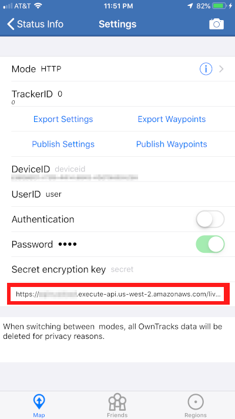
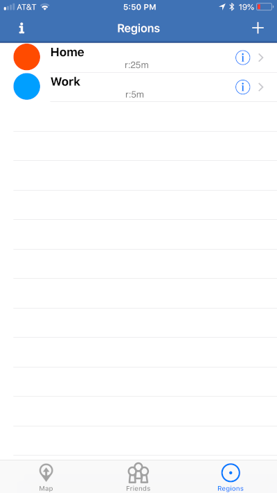
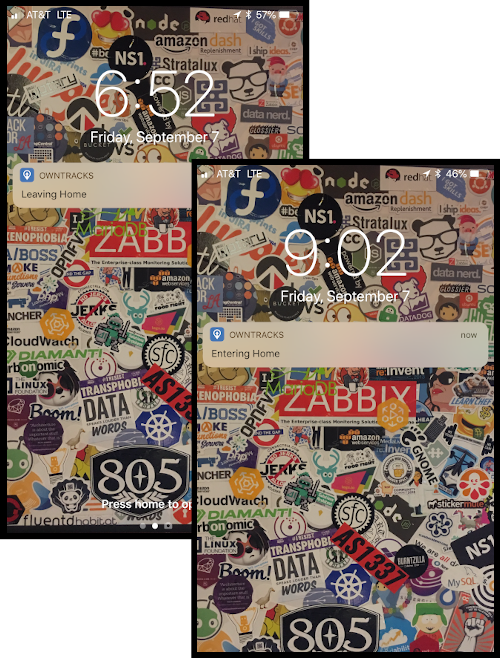

# owntracker

Serverless location tracking HTTP endpoints for use with [Owntracks](https://owntracks.org). Uses several [AWS](https://aws.amazon.com) services:

* **API Gateway** - Provides HTTP endpoints to point Owntracks client at
* **Lambda** - Processes incoming data streams and performs queries, cleanups, notifications, etc
* **S3** - Stores incoming messages

The backend code is written in Python 3.6 and makes use of the [Pyramid](https://pylonsproject.org) web framework.

Everything is deployed and managed using the [Zappa](https://github.com/Miserlou/Zappa) serverless management framework.

## Requirements

Before you can use this tool, you must have these prerequisites:

* [Amazon Web Services account](https://aws.amazon.com/free/)
* [Administrative IAM API key pair](https://docs.aws.amazon.com/IAM/latest/UserGuide/id_users_create.html) configured on your computer
* Python >3.6 installed on your computer (I use [pyenv](https://github.com/pyenv/pyenv))

## Setup

Assuming you have all the requirements met, the following steps will create everything needed:

```bash
# 1. Define project meta/naming
export PROJECT=owntracker
export CODENAME=lzahq
export ENV=live

# 2. Clone project and install Python dependencies
git clone https://github.com/lalanza808/owntracker.git
cd owntracker
python3 -m venv .venv
source .venv/bin/activate
pip install .

# 3. Setup backend for location data
aws cloudformation deploy \
    --stack-name "${PROJECT}-${CODENAME}-${ENV}" \
    --template-file ./static/owntracker_backend.yaml

# 4. Setup local config files
init_zappa > zappa_settings.json
init_config > owntracker/config.py

# 5. Use Zappa to deploy
zappa deploy
```

The Zappa output should provide you with an endpoint for API Gateway - the HTTP endpoints with Python Lambda scripts being triggered behind them.

I didn't test the above super well. It was already up and running for me and I didn't feel like messing with the data so I whipped together these little functions to assemble configs for you. Hope it helps, but you'll likely have to tinker a bit.

## Usage

The application works by looping through the `devices` specified in `config.py`. Each device gets generated a unique route and view associated with the device's secret token. The secret route is used on your devices: https://xxxxxxxxxx.execute-api.us-west-2.amazonaws.com/live/device/TOKEN

When a device POSTs to the endpoint the location data payload gets converted into CSV and stored into the data paths, and also gets stored as JSON to a `$DEVICE-status.json` file which can be retrieved for a "current" look into the device's location; the last reported location data.

The first device is auto-generated, but feel free to substitute it's values with your own. If you want multiple devices, append another device to the dictionary in the config with a new secret token.

You'll have to configure each device that you want to report in. Find a way to share the deployed API Gateway endpoint, the device name, and device secret token with each of your devices. Dial the values into the app by accessing the settings.



Once you add your API Gateway endpoint, the app should begin communicating with it and data should hit S3. You can check logs via `zappa tail`.

I also set my Owntracks app to mode `Move` to get data flowing in all the time. That's pretty much it! Now just leave it alone and go about your business. Check back in a few weeks later and check out all the data!

### Setup Regions

Within the app you can optionally setup Regions - places of interest to you. You can use them for many purposes, but I typically use them for Home, Work, Cabin, etc.

You need to create a new region, provide it a proper label, and set a radius. The app will indicate when you are within the region and the payloads deliver will include it. Regions are a great way to trigger workflows and automations.





You can use simple logic to determine if you're home and have devices set to check. A simple crontab with a shell script will work fine for a simple setup.

```bash
curl -s https://xxxxxxxxxx.execute-api.us-west-2.amazonaws.com/live/status/DEVICE | grep Home

if [[ $? == 0 ]]
then
  echo -e "[+] Looks like you're home. Doing thing."
  # dothing
else
  echo -e "[+] Looks like you're not home. Doing other thing."
  # dootherthing
fi
```

### Analyzing Your Data

This subject is a whole other animal that we'll have to cover in another document. Go here: [Analyzing your data](./static/analyzing_data.md)
